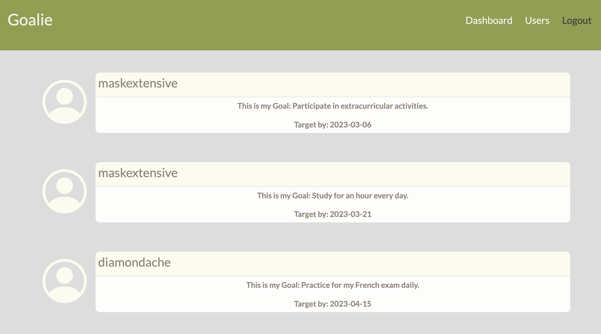

# your-goals-tracker

## Description

Application to share and view goals with piers using chart.js to be able to vizualize the data. Live deployed on Heroku!

## APIs/Frameworks
- <a href="https://www.chartjs.org/" >chart.js</a>

## User Story

AS A student 
 I want a place where I can share my goals and check out other students’s goals 
 
So THAT I can stay motivated and inspired

## Screenshots

## Credits
UW Boot Camp

## License

Please refer to the LICENSE in the repo.

## Deployed
Find our site [here!](https://goalie.herokuapp.com/)

## Moving Forward

Some future ideas we have for this application:
- Select various goal types using tags
- Adding a chart to track milestones 
- Adding ability to "friend" piers
- Privacy settings option to enable making goals public, only able to be seen by friends, or completely private
- Add a hamburger menu

## Technologies
- Node.js
- Sequelize
- Express
- MySQL Workbench
- Chart.js
- MVC framework
- Heroku

## Contact

<a href="https://www.linkedin.com/in/sylviaely/" >LinkedIn: Sylvia Ely</a>

<a href="https://www.linkedin.com/in/emilia-trentham-987a59164/" >LinkedIn: Emilia Trentham</a>

<a href="https://www.linkedin.com/in/maksim-razuvaev/">LinkedIn: Maksim Razuvaev</a>

<a href="https://www.linkedin.com/in/jmeyers6/" >LinkedIn: Jacob Meyers</a>
